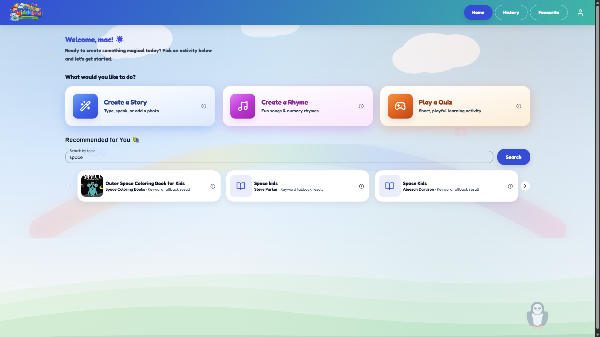

# KiddoLand Platform - Frontend

[](https://kiddoland-platform-ui.onrender.com/)

A privacy-first AI storytelling platform for children.

> Educational Project - COMP 385 Capstone Project  
> Status: Production ready  
> Last updated: August 2026

---

## Table of Contents

- [Overview](#overview)
- [Live Demo](#live-demo)
- [Age Rules](#age-rules)
- [Features](#features)
- [Story Creation System](#story-creation-system)
- [User Management](#user-management)
- [Component Library](#component-library)
- [Architecture](#architecture)
- [Configuration](#configuration)
- [Quick Start](#quick-start)
- [Development Guide](#development-guide)
- [Testing](#testing)
- [Troubleshooting](#troubleshooting)
- [Deployment](#deployment)
- [Contributing](#contributing)

---

## Overview

KiddoLand is a child-safe AI storytelling platform that generates personalized stories, rhymes, learning activities, and book recommendations. The frontend is built as a React single-page application with mode-based routing, session-only state, and a kid-friendly visual design.

The app supports two experiences:

- Home Mode for parents and guardians
- Institution Mode for teachers and classroom use

The frontend communicates with the backend through a configurable API base URL and uses bearer-token authentication for protected routes.

## Live Demo

- Frontend: https://kiddoland-platform-ui.onrender.com/
- Backend API: https://kiddoland-platform-api.onrender.com
- Backend health check: https://kiddoland-platform-api.onrender.com/health

If you run the frontend locally, set `VITE_API_BASE_URL` to the Render backend URL so the app uses the deployed API instead of `http://127.0.0.1:8000`.

## Age Rules

The UI offers age bands from 3-10 years for story, rhyme, and quiz setup.

The backend currently validates ages at 1-10 for story-related API calls. The frontend therefore normalizes the oldest age band down to 10 before the request reaches the API. That is the rule the code actually uses today.

## Features

### Story Creation

- Accepts free-form text prompts
- Supports voice transcription in supported browsers
- Lets users upload images and turn them into story context
- Applies story preferences such as age band, interests, tone, goal, mood, language, and story length
- Generates stories through the backend AI endpoint
- Can include optional TTS audio for read-aloud playback
- Can generate a story video when the export flow is used
- Lets users refine a story and save it to favorites
- Supports audio and HTML/story downloads

### Rhyme Creation

- Creates nursery-style rhymes from a topic or prompt
- Lets users choose rhyme style, pattern, length, tone, purpose, and learning focus
- Supports text input, voice input, and image-inspired prompts
- Can include read-aloud audio when enabled
- Supports favorite saving and download flows

### Learning Activities

- Generates a kid-friendly quiz activity
- Uses age band, theme, learning goal, and difficulty
- Returns a 5-question multiple-choice activity
- Fits both home and classroom learning flows

### Book Recommendations

- Searches book suggestions by topic
- Uses optional age tailoring for recommendation text
- Renders a searchable recommendation strip on the home dashboard

### History and Favorites

- Shows story history with lazy loading
- Lets users mark and unmark favorites
- Supports deletion from history
- Keeps recently created content available for review

### Authentication and Plans

- Supports guest-first demo access plus login and registration for Home and Institution modes
- Validates and refreshes bearer sessions
- Shows the current profile and mode in the app shell
- Supports free and paid plan updates
- Triggers upgrade prompts when download limits are reached

## Story Creation System

The main story workflow combines several input sources into a single prompt:

- Typed story idea
- Voice transcription
- Uploaded image context
- Age band or explicit age in the prompt
- Interests, tone, learning goal, story type, and mood
- Story length and optional language override

The implementation lives in `src/pages/CreateStoryUnifiedPage.tsx` and builds a combined prompt before sending it to the backend. The page also supports story refinement, optional video generation, and download flows for generated content.

The related backend call is the AI sample endpoint, which returns story text and optional TTS audio.

## User Management

The platform uses bearer-token authentication with mode-aware login, and the root route now bootstraps into an anonymous demo session when no saved session exists.

- `POST /auth/guest` creates a temporary guest session with a unique user id
- `POST /auth/login` signs in a user
- `POST /auth/register` creates a user account
- `GET /auth/validate` validates the current session
- `POST /auth/refresh` refreshes the session token
- `PATCH /auth/plan` updates the user plan between free and paid

The frontend keeps the current user profile, mode, and plan in app state and uses those values to gate protected routes and download limits. Anonymous demo users get a one-time welcome popup on first visit, and guest data is still isolated by `user_id` in the backend collections.

## Component Library

The app is split into reusable components for layout, navigation, cards, buttons, and modal dialogs. The main shell is mode-aware and includes the top navigation, profile menu, and plan controls.

Notable shared pieces include:

- `AppShellLayout`
- `ProtectedRoute`
- `PlanUpgradeDialog`
- `SessionExpiryWarning`
- `SharedNavBar`
- `KiddoCard`
- `KiddoButton`

## Architecture

### Technology Stack

| Technology | Purpose |
|------------|---------|
| React | UI framework |
| TypeScript | Type safety |
| Material UI | Component system |
| React Router | Client routing |
| Lucide React | Icons |
| Vite | Build tool |

### Project Structure

```text
KiddoLand-Platform-UI/
├── src/
│   ├── components/          # Reusable components
│   ├── context/             # App state and auth state
│   ├── pages/               # Route pages
│   ├── theme/               # App theme
│   ├── types/               # Story and preference types
│   ├── utils/               # API clients and helpers
│   ├── App.tsx              # Root router
│   └── main.tsx             # Entry point
├── public/
├── package.json
└── README.md
```

### Routing

Routes are defined in `src/App.tsx` and include Home and Institution flows:

- `/` - anonymous-first bootstrap route
- `/select-mode` - mode selection
- `/auth/home` and `/auth/institution` - authentication screens
- `/home`, `/home/create-story`, `/home/create-rhyme`, `/home/play-learning-activity`
- `/story-history` and `/story-favorites`
- `/institution`, `/institution/create-story`, `/institution/create-rhyme`, `/institution/play-learning-activity`

### State and API Communication

The frontend uses `VITE_API_BASE_URL` when provided, otherwise it falls back to `http://127.0.0.1:8000`.

The main API clients are:

- `src/utils/authApi.ts` for guest login, login, register, validate, refresh, and plan updates
- `src/utils/aiApi.ts` for story generation, rhyme generation, favorites, history, downloads, video generation, and AI sample calls
- `src/utils/recommendationsApi.ts` for book recommendations

All protected requests send a bearer token in the `Authorization` header.

## Configuration

### Prerequisites

- Node.js 16 or newer
- npm
- Modern browser such as Chrome, Edge, Firefox, or Safari

### Install and Run

```bash
npm install
npm run dev
```

The app opens at the local Vite URL shown in the terminal.

### Production Environment

Set the API base URL to the Render backend when deploying or testing against the live service:

```env
VITE_API_BASE_URL=https://kiddoland-platform-api.onrender.com
```

## Quick Start

1. Open the frontend in the browser.
2. Let the anonymous demo session load or select Home Mode / Institution Mode.
3. Sign in or register if you want a persistent account.
4. Create a story, rhyme, quiz, or video.
5. Save favorites or review history if needed.

## Development Guide

If you are updating the UI or API integration, the most important files are:

- `src/App.tsx` for route definitions
- `src/utils/aiApi.ts` for story, rhyme, favorite, history, download, and video calls
- `src/utils/authApi.ts` for guest login, login, register, validate, refresh, and plan changes
- `src/utils/recommendationsApi.ts` for book recommendations
- `src/types/storyOptions.ts` for age bands and story preferences
- `src/pages/CreateStoryUnifiedPage.tsx` for the main story workflow
- `src/pages/CreateRhymePage.tsx` for rhyme creation
- `src/pages/PlayLearningActivityPage.tsx` for quiz generation
- `src/pages/StoryHistoryPage.tsx` and `src/pages/StoryFavoritesPage.tsx` for saved content

## Testing

These are the demo credentials referenced by the app and backend README:

- Home Mode: `parent@kiddoland.local` / `Parent123!`
- Institution Mode: `teacher@kiddoland.local` / `Teacher123!`

If you are testing the live deployment, confirm the frontend is using the Render backend URL and not the local default.

## Troubleshooting

- If the app cannot log in, confirm the backend URL and bearer token flow.
- If story or rhyme requests fail, check that the selected age band maps to the backend's 1-10 validation.
- If TTS is missing, the app still returns the story text; audio is optional.
- If the recommendation strip is empty, verify the topic and backend connectivity.
- If downloads are blocked, check the current plan and the free quota state.

## Deployment

The frontend is deployed on Render at:

- https://kiddoland-platform-ui.onrender.com/

When deploying a new build, make sure the production environment uses:

- `VITE_API_BASE_URL=https://kiddoland-platform-api.onrender.com`

This keeps the frontend pointed at the production backend instead of localhost.

## Contributing

The code is organized for a software engineering portfolio and job application showcase. Preserve the privacy-first flow, the age validation behavior, and the mode-aware experience when making future changes.

---

Built for the KiddoLand academic project.
